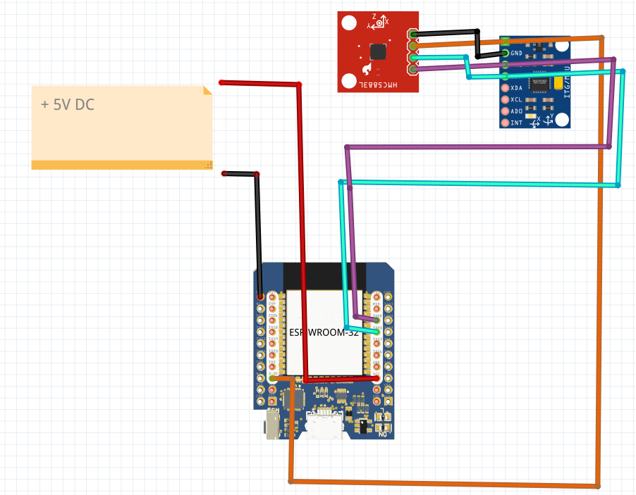

# OVERVIEW

This is a complete example to build an IMU WiFi ROS publisher using:
* ESP32
* MPU6050 Accelerometer and Gyroscope
* QMC5883 Magnetometer

# SCHEMATIC


The MPU6050 standard I2C Address is at 0x68
The QMC5883 standard I2C Address is at 0x0D

# TEST

## Run a micro-ROS agent on a PC in your network

As any micro-ROS node, you need to run a ROS2 Agent to interface it.

```
ros2 run micro_ros_agent micro_ros_agent udp4 --port 8888 
 ```

If you don't know much about it, please read here how to run a micro-ROS agent on a PC in your network.
https://technologiehub.at/project-posts/micro-ros-on-esp32-tutorial/#:~:text=1.%20Create%20the%20micro%2DROS%20Agent

## Upload to the ESP32

If everything is Ok, you shuold see something like this:

.....
Connected to Wi-Fi
IP Address: 192.168.1.217
SSID: TIM-123467
BSSID: 6C:99:61:3F:0C:F4
rmw_uros_set_custom_transport...
rcl_get_default_allocator...
rclc_support_init...
rclc_node_init_default...
rclc_publisher_init_default /imu...
IMU initialization successful


